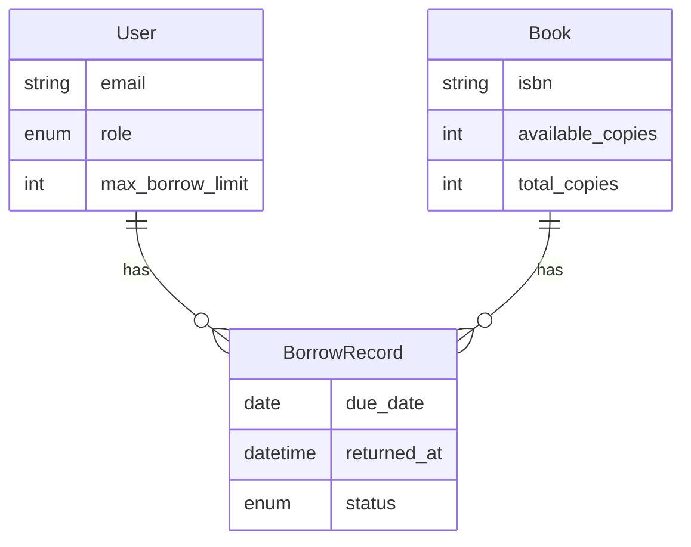
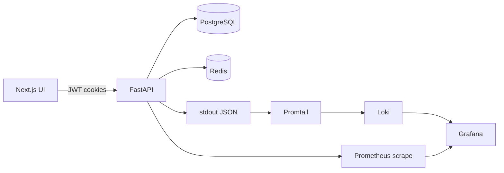

# Library Management System (HNU)

Full-stack **library** app: **FastAPI** backend, **Next.js 16** + **shadcn/ui** frontend, **PostgreSQL**, **Redis** (cache + JWT), **Prometheus + Grafana + Loki** for metrics and logs, **Docker Compose** for the full stack.

## Team (update for your course)

| Name | Role in project | Main areas | GitHub |
|------|-----------------|------------|--------|
| _Member 1_ | _e.g. Backend lead_ | Borrow API, tests | @… |
| _Member 2_ | _e.g. Frontend lead_ | UI, auth flows | @… |
| _Member 3_ | _e.g. DevOps_ | Docker, observability | @… |
| _Member 4_ | _e.g. PM / integration_ | README, API review | @… |

Use **feature branches** and **small, traceable commits** per person—see [CONTRIBUTING.md](CONTRIBUTING.md).

## Features (rubric mapping)

| Requirement | Where it lives |
|-------------|----------------|
| Modular FastAPI (routers, models, schemas, services) | [backend_fastapi/app/](backend_fastapi/app/) |
| REST + Pydantic + envelope + HTTP status codes | All routers; [app/utils/response.py](backend_fastapi/app/utils/response.py) |
| JWT (register, login, refresh, cookies, protected routes) | [app/api/routers/auth.py](backend_fastapi/app/api/routers/auth.py), [app/api/deps/auth.py](backend_fastapi/app/api/deps/auth.py) |
| Roles: `admin` / `member`, RBAC | `admin_only`, `require_roles`, `/users`, `/books` mutations |
| Borrow / return, limits, history | [app/services/borrow_service.py](backend_fastapi/app/services/borrow_service.py), `/borrow`, `/borrow/me` |
| Redis cache-aside + invalidation | Books + borrow history caches; `X-Cache` header |
| Structured logging | JSON logs in [app/core/logging_config.py](backend_fastapi/app/core/logging_config.py), request middleware in [main.py](backend_fastapi/app/main.py) |
| Prometheus metrics | `GET /metrics`; Grafana dashboard |
| Grafana + Loki logs | Promtail ships `hnu_backend` container logs |
| pytest + TestClient | [backend_fastapi/tests/](backend_fastapi/tests/) |
| Next.js UI (login, CRUD, borrow) | [frontend/app/](frontend/app/) |
| Docker Compose full stack | [docker-compose.yml](docker-compose.yml) |

## Architecture





## Quick start (host)

### 1. Infrastructure

From repo root:

```bash
docker compose up -d postgres redis prometheus loki promtail grafana backend
```

Copy [backend_fastapi/.env.example](backend_fastapi/.env.example) to `backend_fastapi/.env` if needed. When the API runs **on the host**, point `DATABASE_URL` / `REDIS_URL` at `localhost`.

### 2. Backend (local Python)

```bash
cd backend_fastapi
python3 -m venv .venv && source .venv/bin/activate
pip install -r requirements.txt -r requirements-dev.txt
cp .env.example .env   # set DATABASE_URL, REDIS_URL
alembic upgrade head
uvicorn app.main:app --reload --host 0.0.0.0 --port 8000
```

- API docs: <http://localhost:8000/docs>
- Health: <http://localhost:8000/health>

### 3. Tests

```bash
cd backend_fastapi
pytest
```

### 4. Frontend (local)

```bash
cd frontend
cp .env.example .env.local   # NEXT_PUBLIC_API_BASE_URL=http://localhost:8000
npm install
npm run dev
```

Open <http://localhost:3000>.

**Default admin** (when `BOOTSTRAP_ADMIN=true` in dev): see `.env.example` (`BOOTSTRAP_ADMIN_EMAIL` / `BOOTSTRAP_ADMIN_PASSWORD`).

## Docker (full stack)

Build and run everything including UI:

```bash
docker compose up -d --build
```

| Service | Default URL |
|---------|-------------|
| Frontend | <http://localhost:3000> |
| Backend | <http://localhost:8000> |
| Grafana | <http://localhost:3001> (admin / admin unless overridden) |
| Prometheus | <http://localhost:9090> |
| Loki | <http://localhost:3100> (usually queried via Grafana) |

Set `NEXT_PUBLIC_API_BASE_URL` at **build time** for the frontend image (Compose `args`) so the browser calls the correct API host (typically `http://localhost:8000` when publishing ports on the machine).

### Observability

- **Metrics:** Prometheus scrapes `backend:8000/metrics`. Grafana dashboard **FastAPI overview** (requests, p95 latency, 5xx rate, scrape health).
- **Logs:** Promtail forwards logs only from container **`hnu_backend`** into Loki; the dashboard includes a **Recent ERROR/WARNING logs** panel.

### Cache demo

Hit `GET /books` twice with cookies; second response should show `X-Cache: HIT`. The books page shows the same badge in the UI.

## Repository layout

| Path | Purpose |
|------|---------|
| [backend_fastapi/](backend_fastapi/) | FastAPI app, Alembic, Dockerfile, tests |
| [frontend/](frontend/) | Next.js App Router, shadcn/ui, Dockerfile |
| [observability/](observability/) | Prometheus, Grafana provisioning, Loki & Promtail configs |

## API summary

- `POST /auth/register`, `POST /auth/login`, `POST /auth/logout`, `POST /auth/refresh`, `GET /auth/me`
- `GET|POST|PATCH|DELETE /books` (members read; admin write)
- `POST /borrow`, `POST /borrow/{id}/return`, `GET /borrow/me`, `GET /borrow` (admin), `GET /borrow/{id}`
- `GET /users`, `POST /users` (admin create), `GET /users/me`, `PATCH|PUT /users/{id}` (admin)
- `GET /health`, `GET /metrics`

Responses use `{ success, message, data, error, meta }`.

## Backend package documentation (what each module does)

### `auth` (authentication) — [`backend_fastapi/app/api/routers/auth.py`](backend_fastapi/app/api/routers/auth.py)

- **Purpose**: user registration + login using **JWT access + refresh** tokens stored in **HttpOnly cookies**.
- **Token validation**: [`backend_fastapi/app/api/deps/auth.py`](backend_fastapi/app/api/deps/auth.py) reads cookies and validates:
  - signature + expiry
  - Redis revocation (`jwt:revoked:{jti}`)
  - `users.token_version` claim (`tv`) for global logout/revocation

**Member/Admin actions**
- **Register**: `POST /auth/register` → creates a **member** user.
- **Login**: `POST /auth/login` → sets cookies `access_token_cookie` + `refresh_token_cookie`.
- **Logout**: `POST /auth/logout` → clears cookies.
- **Refresh**: `POST /auth/refresh` → requires refresh cookie; rotates access cookie.
- **Revoke**: `POST /auth/revoke` → revokes refresh jti in Redis + bumps `token_version`.
- **Me**: `GET /auth/me` → current user profile.

### `users` (admin user management) — [`backend_fastapi/app/api/routers/users.py`](backend_fastapi/app/api/routers/users.py)

- **Purpose**: admin can list/update/create users.

**Admin actions**
- `GET /users` — list users with pagination + search.
- `POST /users` — create user with **role**, **password**, **limit**, and **active**.
- `PATCH|PUT /users/{id}` — update role / `max_borrow_limit` / `is_active`.

**Member actions**
- `GET /users/me` — current profile (alias; `/auth/me` also exists).

### `books` (catalog) — [`backend_fastapi/app/api/routers/books.py`](backend_fastapi/app/api/routers/books.py)

- **Purpose**: library catalog CRUD.
- **Cache**: Redis **cache-aside** on `GET /books` and `GET /books/{id}` with `X-Cache: HIT|MISS`.
- **Invalidation**: on create/update/delete + borrow/return.

**Member actions**
- `GET /books` — list books.
- `GET /books/{id}` — book details.

**Admin actions**
- `POST /books` — create.
- `PATCH|PUT /books/{id}` — update.
- `DELETE /books/{id}` — delete.

### `borrow_records` (borrowing workflow) — [`backend_fastapi/app/api/routers/borrow.py`](backend_fastapi/app/api/routers/borrow.py)

- **Purpose**: borrow/return system, availability validation, history.
- **Business rules** (in [`backend_fastapi/app/services/borrow_service.py`](backend_fastapi/app/services/borrow_service.py)):
  - cannot borrow unavailable books (`available_copies == 0`)
  - one active borrow per user+book
  - enforce `users.max_borrow_limit`
  - row-lock the `books` row during borrow/return

**Member actions**
- `POST /borrow` — borrow a book.
- `POST /borrow/{id}/return` — return your own borrow.
- `GET /borrow/me` — your history (cached, `X-Cache`).

**Admin actions**
- `GET /borrow` — list all records with filters (`status`, `user_id`, `book_id`).
- `GET /borrow/{id}` — any record.
- `POST /borrow/{id}/return` — force return any record.

## Frontend actions (what members and admins can do)

### Member UI
- **Register/Login**: `/register`, `/login`
- **Browse books**: `/books` and `/books/[id]`
- **Borrow**: from `/books` or book detail
- **Return**: `/me`

### Admin UI
- **Manage books**: create `/books/new`, edit `/books/[id]/edit`, delete from detail
- **All borrow records**: `/admin/records` (filters + force return)
- **Manage users**: `/admin/users` (edit role/limit/active + **Create user** dialog)
